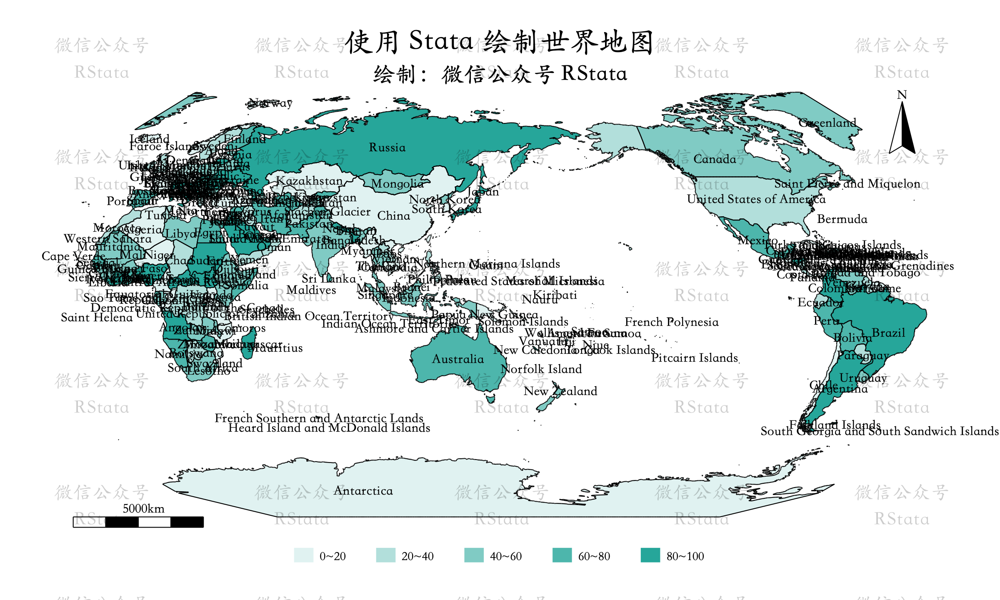
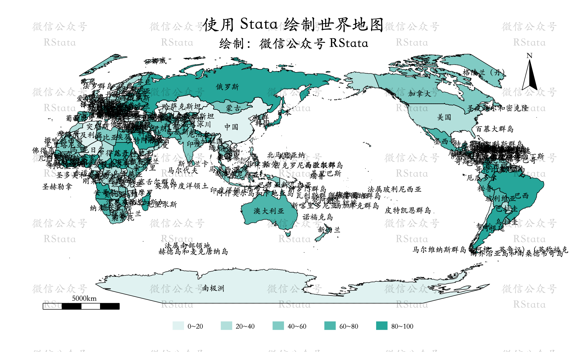
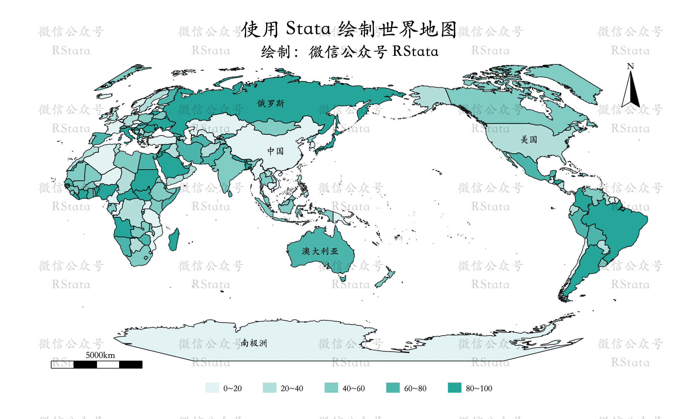
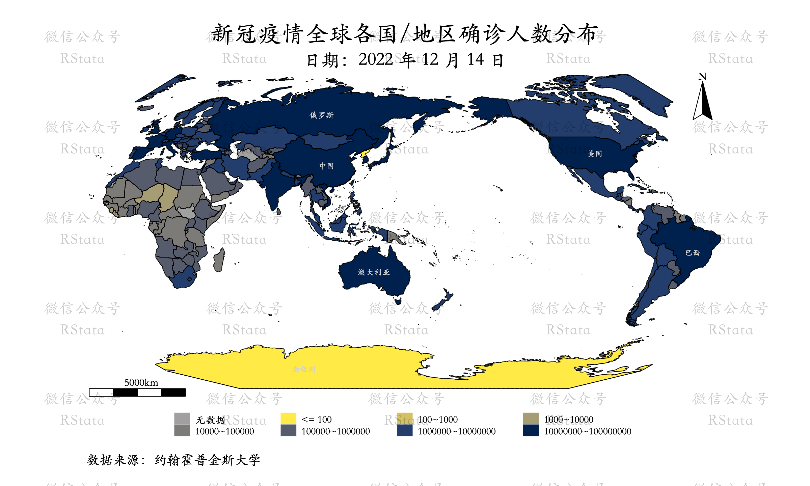
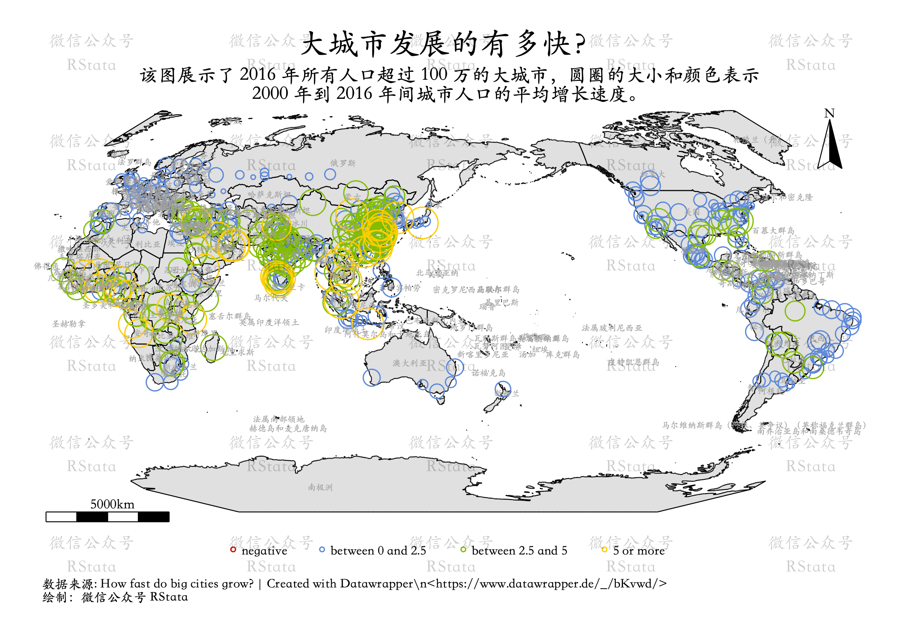
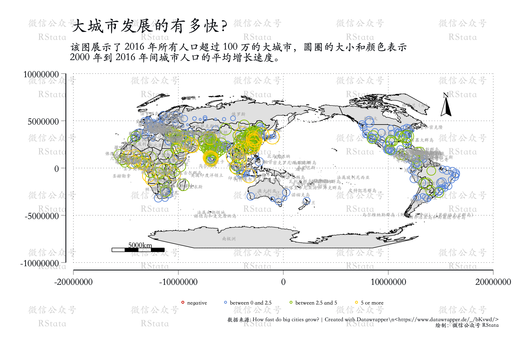
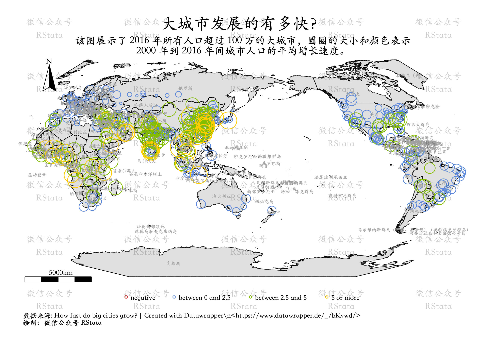

## worldmap_stata：使用 Stata 绘制以太平洋为中心的世界地图

> 网上的世界地图里面关于中国的边界都是错误的，因此这里提供一份正确的。
>
> 该数据及绘图方法由 `微信公众号 RStata`
> 设计，如需使用在商业文书、论文或者出版书籍中，需要购买 RStata
> 会员进而获得授权。（购买链接：<https://rstata.duanshu.com/#/>）。

Stata 绘制地图时自带的比例尺和指北针效果很差，因为我特意设计了一份使用
Stata 绘制世界地图的数据。

这份数据包含如下文件：

1.  worldmap_db.dta：世界各国属性数据
2.  worldmap_coord.dta：世界各国地理矢量数据
3.  worldmap_label2.dta：世界各国名称标签位置数据
4.  worldmap_line_db.dta：世界各国边界属性数据
5.  worldmap_line_coord.dta：世界各国边界地理矢量数据
6.  worldmap_polygon.dta：用于绘制指北针和比例尺的黑色区域

该份地图的原始数据来源于 Nature Earth，获取后使用 R
语言对中国的境界进行修正，去除香港、澳门和台湾（都归类到中国了）。另外在添加比例尺和指北针数据。

关于这种操作，感兴趣的小伙伴可以学习这两个课程：

1.  如何绘制以太平洋为中心的世界地图？：<https://rstata.duanshu.com/#/brief/course/baed82ae2daa421a9721aa2499dd7405>
2.  使用 R 语言操作地理矢量数据、使用 Stata
    绘制精美地图：<https://rstata.duanshu.com/#/brief/course/c51384ae56994495b223b366c7449377>

## 填充地图的绘制

例如我们在 `worldmap_db.dta` 文件中生成一个随机变量：

``` stata
use worldmap_db.dta, clear 
*- 生成个随机变量
set seed 100
gen value = uniform() * 100
spmap value using worldmap_coord, id(ID) ///
  osize(vvthin ...) ocolor(white ...) ///
  clmethod(custom) clbreaks(0 20 40 60 80 100) ///
  fcolor("224 242 241" "178 223 219" "128 203 196" "77 182 172" "38 166 154") ///
  graphr(margin(medium)) /// 
  polygon(data(worldmap_polygon) fcolor(black) ///
    osize(vvthin)) ///
  label(data(worldmap_label2) x(X) y(Y) ///
    label(country) length(40) size(*0.8)) ///
  line(data(worldmap_line_coord.dta) size(vthin ...) ///
    pattern(solid ...) ///
    color(black ...)) ///
  leg(order(2 "0~20" 3 "20~40" 4 "40~60" 5 "60~80" 6 "80~100") ///
    ring(1) pos(6) row(1)) /// 
  ti("使用 Stata 绘制世界地图") ///
  subti("绘制：微信公众号 RStata") xsize(10) ysize(6) 

gr export "pic1.png", width(2400) replace 
```



`worldmap_label2.dta` 数据中还有一个 country_cn
变量，是各个国家或地区的中文名称：

``` stata
*- 中文标签
spmap value using worldmap_coord, id(ID) ///
  osize(vvthin ...) ocolor(white ...) ///
  clmethod(custom) clbreaks(0 20 40 60 80 100) ///
  fcolor("224 242 241" "178 223 219" "128 203 196" "77 182 172" "38 166 154") ///
  graphr(margin(medium)) /// 
  polygon(data(worldmap_polygon) fcolor(black) ///
    osize(vvthin)) ///
  label(data(worldmap_label2) x(X) y(Y) ///
    label(country_cn) length(60) size(*0.8)) ///
  line(data(worldmap_line_coord.dta) size(vthin ...) ///
    pattern(solid ...) ///
    color(black ...)) ///
  leg(order(2 "0~20" 3 "20~40" 4 "40~60" 5 "60~80" 6 "80~100") ///
    ring(1) pos(6) row(1)) /// 
  ti("使用 Stata 绘制世界地图") ///
  subti("绘制：微信公众号 RStata") xsize(10) ysize(6) 

gr export "pic2.png", width(2400) replace 
```



每次都添加所有国家的标签可能会很混乱，可以使用下面的方法选择部分国家的标签添加：

``` stata
*- 选择部分国家标签添加
spmap value using worldmap_coord, id(ID) ///
  osize(vvthin ...) ocolor(white ...) ///
  clmethod(custom) clbreaks(0 20 40 60 80 100) ///
  fcolor("224 242 241" "178 223 219" "128 203 196" "77 182 172" "38 166 154") ///
  graphr(margin(medium)) /// 
  polygon(data(worldmap_polygon) fcolor(black) ///
    osize(vvthin)) ///
  label(data(worldmap_label2) x(X) y(Y) ///
    select(keep if inlist(country_cn, "中国", "美国", ///
        "俄罗斯", "澳大利亚", "南极洲", "N", "5000km")) /// 
    label(country_cn) length(40) size(*0.8)) ///
  line(data(worldmap_line_coord.dta) size(vthin ...) ///
    pattern(solid ...) ///
    color(black ...)) ///
  leg(order(2 "0~20" 3 "20~40" 4 "40~60" 5 "60~80" 6 "80~100") ///
    ring(1) pos(6) row(1)) /// 
  ti("使用 Stata 绘制世界地图") ///
  subti("绘制：微信公众号 RStata") xsize(10) ysize(6) 

gr export "pic3.png", width(2400) replace 
```



下面我们再使用实际数据演示下这份数据的使用。这里以 2022 年 12 月 14
日全球各国新冠肺炎确诊数据为例：

``` stata
*- 实际数据绘制
use "world-covid19.dta", clear 
*- 保留最后一天的数据
sum date 
keep if date == r(max) 
save "mydata", replace 

use worldmap_db.dta, clear 
ren iso3 iso 
merge 1:m iso using mydata
replace confirmed = -1 if missing(confirmed) 
drop if _m == 2 

spmap confirmed using worldmap_coord, id(ID) ///
  osize(vvthin ...) ocolor(white ...) ///
  clmethod(custom) clbreaks(-1 0 1e2 1e3 1e4 1e5 1e6 1e7 1e8) ///
  fcolor(gs10 "255 234 70" "211 193 100" "166 157 117" "124 123 120" "87 92 109" "35 62 108" "0 32 77") ///
  graphr(margin(medium)) /// 
  polygon(data(worldmap_polygon) fcolor(black) ///
    osize(vvthin)) ///
  label(data(worldmap_label2) x(X) y(Y) /// 
    by(group) color(gs13 black) size(*0.6 *0.8) /// 
    select(keep if inlist(country_cn, "中国", "美国", "巴西", ///
        "俄罗斯", "澳大利亚", "南极洲", "N", "5000km")) /// 
    label(country_cn) length(80 ...)) ///
  line(data(worldmap_line_coord.dta) size(vthin ...) ///
    pattern(solid ...) ///
    color(black ...)) ///
  leg(order(2 "无数据" 3 "<= 100" 4 "100~1000" 5 "1000~10000" ///
    6 "10000~100000" 7 "100000~1000000" 8 "1000000~10000000" ///
    9 "10000000~100000000") ///
    ring(1) pos(6) row(2)) /// 
  ti("新冠疫情全球各国/地区确诊人数分布") ///
  subti("日期：2022 年 12 月 14 日") xsize(10) ysize(6) ///
  caption("数据来源：约翰霍普金斯大学", size(*0.8)) 

gr export "pic4.png", width(2400) replace 
```



## 在地图上添加散点图

这份地图数据的坐标参考系是
`+proj=eck3 +lat_0=0 +lon_0=150 +x_0=0 +y_0=0 +datum=WGS84 +units=m +no_defs`，似乎
geo2xy 命令不支持把经纬度转换成这个坐标系，所以我编写了一个
网页应用来帮助转换：<https://czxb.shinyapps.io/crs-trans/>

把页面上的 crs 设置成
`+proj=eck3 +lat_0=0 +lon_0=150 +x_0=0 +y_0=0 +datum=WGS84 +units=m +no_defs`，然后上传带
lon 和 lat 变量的 csv 文件即可下载转换后的结果（lon 和 lat
变量必须是数值型的）。

再把转换后的结果和原始数据合并：

``` stata
import delimited using "转换后的数据.csv", clear 
gen id = _n 
save temp, replace 

import delimited using "data.csv", clear 
gen id = _n 
merge 1:1 id using temp 
drop id _m 
destring ratio, replace force 
*- ssc install sencode 
sencode category, gen(group) gsort(ratio)
save pointdata, replace 

*- 删除 temp.dta 
cap erase temp.dta 
```

然后就可以绘制地图了：

``` stata
*- 绘制到地图上 
use worldmap_db.dta, clear 
spmap using worldmap_coord, id(ID) ///
  osize(vvthin ...) ocolor(white ...) ///
  fcolor(gs14 ...) ///
  graphr(margin(medium)) /// 
  polygon(data(worldmap_polygon) fcolor(black) ///
    osize(vvthin)) ///
  label(data(worldmap_label2) x(X) y(Y) /// 
    by(group) color(gs10 black) size(*0.5 *0.8) /// 
    label(country_cn) length(80 ...)) ///
  line(data(worldmap_line_coord.dta) size(vthin ...) ///
    pattern(solid ...) ///
    color(black ...)) ///
  leg(pos(6) row(1) ring(1)) ///
  point(data(pointdata) x(x) y(y) proportional(ratio) ///
    shape(Oh ...) size(*0.4) legenda(on) ///
    by(group) fcolor("204 12 0" "92 136 218" "132 189 0" "255 205 0")) ///
  ti("大城市发展的有多快？") ///
  subti("该图展示了 2016 年所有人口超过 100 万的大城市，圆圈的大小和颜色表示" "2000 年到 2016 年间城市人口的平均增长速度。", size(*0.8)) xsize(10) ysize(7) ///
  caption("数据来源: How fast do big cities grow? | Created with Datawrapper\n<https://www.datawrapper.de/_/bKvwd/>" "绘制：微信公众号 RStata", size(*0.6)) 

gr export "pic5.png", width(2400) replace 
```



## 移动指北针和比例尺的位置

这里以把指北针移动到左上方为例，比例尺的移动方法类似：

指北针包含三个部分，线性部分、多边形部分和标签部分，因此需要同时修改
worldmap_line_coord.dta、worldmap_polygon.dta 和 worldmap_label2.dta
文件。

首先使用 freestyle 确定位置坐标：

``` stata
use worldmap_db.dta, clear 
spmap using worldmap_coord, id(ID) ///
  osize(vvthin ...) ocolor(white ...) ///
  fcolor(gs14 ...) ///
  graphr(margin(medium)) /// 
  polygon(data(worldmap_polygon) fcolor(black) ///
    osize(vvthin)) ///
  label(data(worldmap_label2) x(X) y(Y) /// 
    by(group) color(gs10 black) size(*0.5 *0.8) /// 
    label(country_cn) length(80 ...)) ///
  line(data(worldmap_line_coord.dta) size(vthin ...) ///
    pattern(solid ...) ///
    color(black ...)) ///
  leg(pos(6) row(1) ring(1)) ///
  point(data(pointdata) x(x) y(y) proportional(ratio) ///
    shape(Oh ...) size(*0.4) legenda(on) ///
    by(group) fcolor("204 12 0" "92 136 218" "132 189 0" "255 205 0")) ///
  ti("大城市发展的有多快？") ///
  subti("该图展示了 2016 年所有人口超过 100 万的大城市，圆圈的大小和颜色表示" "2000 年到 2016 年间城市人口的平均增长速度。", size(*0.8)) xsize(10) ysize(7) ///
  caption("数据来源: How fast do big cities grow? | Created with Datawrapper\n<https://www.datawrapper.de/_/bKvwd/>" "绘制：微信公众号 RStata", size(*0.6)) freestyle 

gr export "pic6.png", width(2400) replace 
```



可以看到如果想把指北针的位置移动到左上方，X 坐标需要 -
30000000（这个单位实际上是 m）：

``` stata
*- 移动线条
use worldmap_line_db.dta, clear 
*- 指北针对应的 ID 是 240 和 241 
use worldmap_line_coord.dta, clear 
replace _X = _X - 30000000 if inlist(_ID, 240, 241)
save worldmap_line_coord2.dta, replace 

*- 移动多边形
use worldmap_polygon, clear 
*- worldmap_polygon 数据中指北针对应的 ID 是 239 (四个点围成三角形) 
replace _X = _X - 30000000 if inlist(_ID, 239) 
save worldmap_polygon2, replace 

*- 移动标签
use worldmap_label2, clear 
replace X = X - 30000000 if country == "N"
save worldmap_label22, replace 

*- 重新绘图
use worldmap_db.dta, clear 
spmap using worldmap_coord, id(ID) ///
  osize(vvthin ...) ocolor(white ...) ///
  fcolor(gs14 ...) ///
  graphr(margin(medium)) /// 
  polygon(data(worldmap_polygon2) fcolor(black) ///
    osize(vvthin)) ///
  label(data(worldmap_label22) x(X) y(Y) /// 
    by(group) color(gs10 black) size(*0.5 *0.8) /// 
    label(country_cn) length(80 ...)) ///
  line(data(worldmap_line_coord2.dta) size(vthin ...) ///
    pattern(solid ...) ///
    color(black ...)) ///
  leg(pos(6) row(1) ring(1)) ///
  point(data(pointdata) x(x) y(y) proportional(ratio) ///
    shape(Oh ...) size(*0.4) legenda(on) ///
    by(group) fcolor("204 12 0" "92 136 218" "132 189 0" "255 205 0")) ///
  ti("大城市发展的有多快？") ///
  subti("该图展示了 2016 年所有人口超过 100 万的大城市，圆圈的大小和颜色表示" "2000 年到 2016 年间城市人口的平均增长速度。", size(*0.8)) xsize(10) ysize(7) ///
  caption("数据来源: How fast do big cities grow? | Created with Datawrapper\n<https://www.datawrapper.de/_/bKvwd/>" "绘制：微信公众号 RStata", size(*0.6)) 

gr export "pic7.png", width(2400) replace 
```



比例尺的移动方法类似，这里就不再赘述了。

------------------------------------------------------------------------

<h4 align="center">

使用须知

</h4>

<h6 align="center">

该数据及绘图方法由 <b>微信公众号 RStata </b>
设计，如需使用在商业文书、论文或者出版书籍中，需要购买 RStata
会员进而获得授权。购买链接：<a href='https://rstata.duanshu.com/#/'>https://rstata.duanshu.com/#/</a>）。

</h6>

<h4 align="center">

License

</h4>

<h6 align="center">

© 微信公众号 RStata

</h6>
